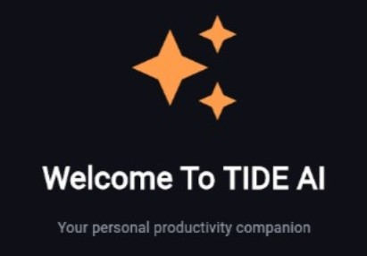
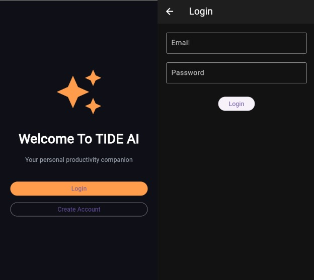

<div align="center">

# 🌊 TIDE AI

### AI-Inspired Productivity & Task Management Mobile Application

<p>
A Flutter-based productivity application prototype designed to help users
organize tasks, manage schedules, and improve productivity through an intuitive
mobile experience.
</p>



<br>


</div>

---

# 📖 About the Project

TIDE AI is a mobile productivity application prototype developed as part of my learning journey in Flutter application development.

The project combines **mobile UI development**, **task management concepts**, **calendar organization**, and an **AI-inspired assistant interface** into a clean and modern application.

Although the current version does **not integrate a live AI model**, the application has been designed with an AI-assisted workflow in mind, making it ready for future AI integration.

This project allowed me to gain practical experience in building complete mobile interfaces while learning Flutter, Dart, Firebase integration, and application architecture.

---

# ✨ Features

- ✅ User Authentication
- ✅ Task Management
- ✅ Calendar Management
- ✅ Productivity Tracking
- ✅ User Profile
- ✅ AI-inspired Assistant Interface
- ✅ Modern Material UI
- ✅ Responsive Flutter Layout

---

# 📱 Application Screens

## Login

<p align="center">

</p>

---

## Home Dashboard

<p align="center">

</p>

---

## Task Management

<p align="center">

</p>

---

## Calendar

<p align="center">

</p>

---

## AI Assistant

<p align="center">

</p>

---

## User Profile

<p align="center">

</p>

---

# 🏗 Project Architecture

```
TIDE AI
│
├── Authentication
│
├── Task Management
│
├── Calendar Module
│
├── AI Assistant Interface
│
├── User Profile
│
└── Firebase Services
```

---

# 🛠 Technologies Used

## Mobile Development

- Flutter
- Dart

## Backend Services

- Firebase Authentication
- Cloud Firestore

## Design

- Figma

## Development Tools

- Android Studio
- Visual Studio Code
- Git
- GitHub
- FlutLab

---

# 📂 Project Structure

```text
TideAI/

├── android/
├── ios/
lib/
│
├── screens/
│   ├── login_screen.dart
│   ├── register_screen.dart
│   ├── ai_assistant_screen.dart
│   └── shared_task_screen.dart
│
├── services/
│   ├── auth_service.dart
│   ├── firestore_service.dart
│   ├── ai_search_service.dart
│   ├── ai_priority_service.dart
│   └── ai_category_service.dart
│
├── widgets/
│   └── ai_priority_banner.dart
│
├── firebase_options.dart
└── main.dart
│
├── screenshots/
│   ├── tideai-cover.jpeg
│   ├── login.jpeg
│   ├── home.jpeg
│   ├── task.jpeg
│   ├── calendar.jpeg
│   ├── AI.jpeg
│   └── profile-page.jpeg
│
├── web/
├── test/
├── pubspec.yaml
└── README.md
```

---

# 🚀 Getting Started

## Clone the repository

```bash
git clone https://github.com/AMRITHA-LAL/TideAI.git
```

Move into the project folder

```bash
cd TideAI
```

Install dependencies

```bash
flutter pub get
```

Run the application

```bash
flutter run
```

---

# 💡 Learning Outcomes

Through this project I learned:

- Flutter application development
- Building reusable widgets
- Firebase integration
- User interface design principles
- Mobile application architecture
- State management concepts
- Git & GitHub workflow
- Project documentation

---

# 🔮 Future Improvements

Planned enhancements include:

- 🤖 Real AI integration using Gemini or OpenAI APIs
- ☁ Cloud synchronization
- 📊 Productivity analytics
- 🔔 Smart reminders & notifications
- 🌙 Dark mode
- 📅 Google Calendar integration
- 👥 Team collaboration
- 📈 Performance improvements

---

# 🌐 Project Links

## Portfolio

https://amritha-lal.github.io/amritha_portfolio/

## Project Details

https://amritha-lal.github.io/amritha_portfolio/tideai.html

## LinkedIn

https://www.linkedin.com/in/amritha-lal-8558aa262

---

# 👩‍💻 Author

**Amritha Lal**

B.Tech Computer Science & Engineering Student

Interested in Software Development, Flutter Development, Artificial Intelligence, and Web Technologies.

GitHub:

https://github.com/AMRITHA-LAL

---

<div align="center">

### ⭐ If you found this project interesting, consider giving it a star!

Thank you for visiting my repository.

</div>
